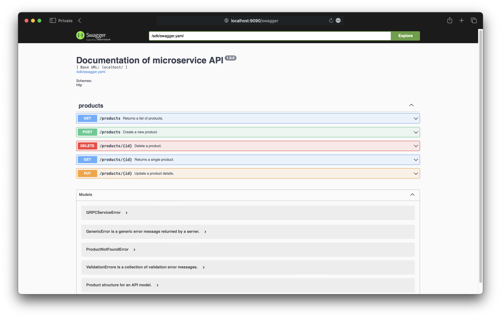
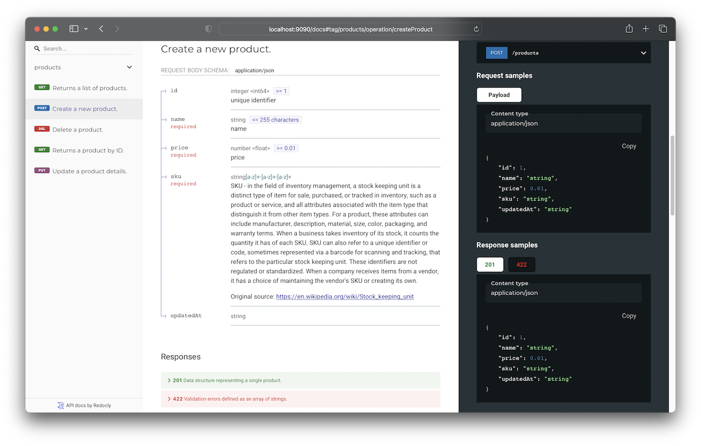

# go-microservice

### Demo API microservice covered by OpenAPI/Swagger-generated documentation. Communicates with gRPC service as well.

📌 OpenAPI/Swagger-generated API Documentation based on Swagger UI is available by [localhost:9090/swagger](http://localhost:9090/swagger)


📌 OpenAPI/Swagger-generated API Documentation based on Redoc is available by [localhost:9090/redoc](http://localhost:9090/redoc)


⚠️ [gRPC server](https://github.com/oleksiivelychko/go-grpc-service) must be running before.

⚠️ Install **swagger** locally before generate:
```
git clone https://github.com/go-swagger/go-swagger && cd go-swagger
git checkout v0.30.4
go install -ldflags "-X github.com/go-swagger/go-swagger/cmd/swagger/commands.Version=$(git describe --tags) -X github.com/go-swagger/go-swagger/cmd/swagger/commands.Commit=$(git rev-parse HEAD)" ./cmd/swagger
```

🎥 Thanks [Nic Jackson](https://www.youtube.com/c/NicJackson) for sharing his knowledge.
